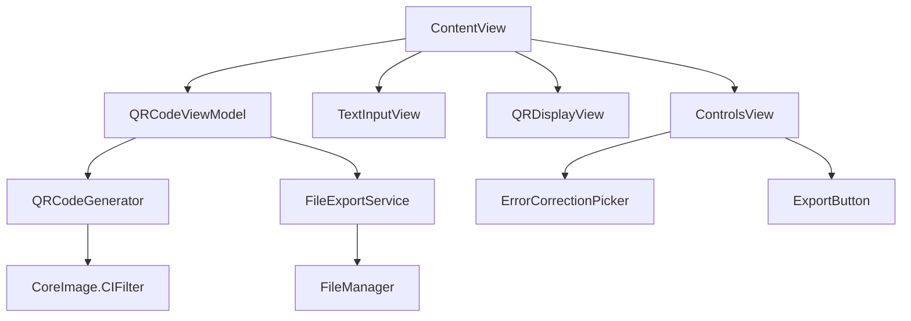

# Design Document

## Overview

The QR Code Generator is a native macOS application that provides real-time QR code generation from text input. The application leverages SwiftUI for the native macOS interface and integrates a QR code generation library to create high-quality SVG outputs. The design emphasizes minimal user interaction, automatic generation, and seamless file export to enhance user productivity.

## Steering Document Alignment

### Technical Standards (tech.md)
As this is a new project, we will establish technical patterns based on macOS development best practices:
- SwiftUI for declarative UI development
- Swift Package Manager for dependency management
- MVVM architecture pattern for separation of concerns
- Combine framework for reactive programming and data binding

### Project Structure (structure.md)
The implementation will follow standard macOS application structure:
- `/Sources`: Main application code
  - `/Views`: SwiftUI view components
  - `/ViewModels`: Business logic and state management
  - `/Models`: Data structures and domain logic
  - `/Services`: QR generation and file operations
  - `/Utilities`: Helper functions and extensions
- `/Resources`: Assets, icons, and configuration files
- `/Tests`: Unit and integration tests

## Code Reuse Analysis

### Existing Components to Leverage
- **CoreImage.CIFilter**: Native iOS/macOS QR code generation capabilities
- **SwiftUI.FileExporter**: Built-in file export functionality
- **AppKit.NSWorkspace**: System integration for file operations
- **Combine.Publishers**: Reactive text input handling with debouncing

### Integration Points
- **macOS File System**: Direct write access to Downloads folder
- **System Preferences**: Dark mode detection and UI adaptation
- **Pasteboard Services**: Clipboard integration for text input

## Architecture

The application follows MVVM (Model-View-ViewModel) architecture with reactive data binding through Combine framework. The design ensures clear separation between UI logic, business logic, and data operations.

### Modular Design Principles
- **Single File Responsibility**: Each Swift file handles one specific view, model, or service
- **Component Isolation**: SwiftUI views are small and focused, composed into larger views
- **Service Layer Separation**: QR generation and file operations isolated in service classes
- **Utility Modularity**: Extensions and helpers organized by functionality



## Components and Interfaces

### ContentView
- **Purpose:** Main application window containing all UI components
- **Interfaces:** 
  - Hosts TextInputView, QRDisplayView, and ControlsView
  - Manages window size and layout
- **Dependencies:** QRCodeViewModel, SwiftUI
- **Reuses:** Standard SwiftUI layout components

### QRCodeViewModel
- **Purpose:** Manages application state and business logic
- **Interfaces:** 
  - `@Published var inputText: String`
  - `@Published var qrCodeImage: NSImage?`
  - `@Published var errorCorrectionLevel: CIQRCodeGenerator.Level`
  - `func generateQRCode()`
  - `func exportToSVG()`
- **Dependencies:** QRCodeGenerator, FileExportService, Combine
- **Reuses:** Combine publishers for reactive updates

### QRCodeGenerator
- **Purpose:** Encapsulates QR code generation logic
- **Interfaces:** 
  - `func generate(from text: String, correctionLevel: Level) -> CIImage?`
  - `func convertToSVG(from ciImage: CIImage) -> String`
- **Dependencies:** CoreImage, CoreGraphics
- **Reuses:** CIFilter for QR generation

### FileExportService
- **Purpose:** Handles file saving operations
- **Interfaces:** 
  - `func saveToDownloads(content: String, filename: String) -> Result<URL, Error>`
  - `func saveWithDialog(content: String, suggestedName: String) -> Result<URL, Error>`
- **Dependencies:** Foundation.FileManager, AppKit.NSSavePanel
- **Reuses:** System file operations

### TextInputView
- **Purpose:** Text input field with real-time updates
- **Interfaces:** 
  - `@Binding var text: String`
  - Debounced text updates (300ms)
- **Dependencies:** SwiftUI.TextEditor
- **Reuses:** SwiftUI text controls

### QRDisplayView
- **Purpose:** Displays generated QR code or placeholder
- **Interfaces:** 
  - `var qrImage: NSImage?`
  - Auto-scaling to fit container
- **Dependencies:** SwiftUI.Image
- **Reuses:** SwiftUI image display

### ControlsView
- **Purpose:** Contains error correction picker and export button
- **Interfaces:** 
  - Error correction level selection
  - Export button with modifier key detection
- **Dependencies:** ErrorCorrectionPicker, ExportButton
- **Reuses:** SwiftUI controls

## Data Models

### QRCodeData
```swift
struct QRCodeData {
    let text: String
    let correctionLevel: CIQRCodeGenerator.Level
    let generatedAt: Date
    var svgContent: String?
}
```

### ErrorCorrectionLevel
```swift
enum ErrorCorrectionLevel: String, CaseIterable {
    case low = "L"      // ~7% correction
    case medium = "M"   // ~15% correction (default)
    case quartile = "Q" // ~25% correction
    case high = "H"     // ~30% correction
    
    var ciLevel: String {
        // Maps to CIQRCodeGenerator correction levels
    }
}
```

### ExportResult
```swift
struct ExportResult {
    let success: Bool
    let filename: String
    let path: URL?
    let error: Error?
}
```

## Error Handling

### Error Scenarios

1. **Text Exceeds QR Capacity:**
   - **Handling:** Calculate maximum capacity based on correction level, show warning when exceeded
   - **User Impact:** Red border on input field, error message below stating capacity limit

2. **File Save Permission Denied:**
   - **Handling:** Catch file system errors, attempt alternate location or show permission request
   - **User Impact:** Alert dialog explaining permission issue with "Open System Preferences" button

3. **Invalid Characters in Input:**
   - **Handling:** Validate input for QR code compatibility, filter or encode special characters
   - **User Impact:** Warning icon with tooltip explaining character limitations

4. **QR Generation Failure:**
   - **Handling:** Fallback to alternative generation method, log error for debugging
   - **User Impact:** Error message in QR display area with retry option

5. **Memory Pressure (Large QR Codes):**
   - **Handling:** Implement size limits, release resources proactively
   - **User Impact:** Warning when approaching limits, suggestion to reduce data or correction level

## Testing Strategy

### Unit Testing
- Test QRCodeGenerator with various input strings and correction levels
- Verify SVG conversion produces valid output
- Test FileExportService with mock FileManager
- Validate error correction level mappings
- Test text capacity calculations

### Integration Testing
- Test complete flow from text input to QR display
- Verify debouncing behavior with rapid text changes
- Test file export to actual file system (temp directory)
- Validate Option-click modifier detection for save dialog
- Test dark mode UI adaptation

### End-to-End Testing
- User enters text and sees QR code appear automatically
- User changes error correction level and QR updates
- User saves file to Downloads folder successfully
- User uses Option-click to save to custom location
- User handles errors gracefully (permissions, capacity)
- Application maintains state across window resize/minimize